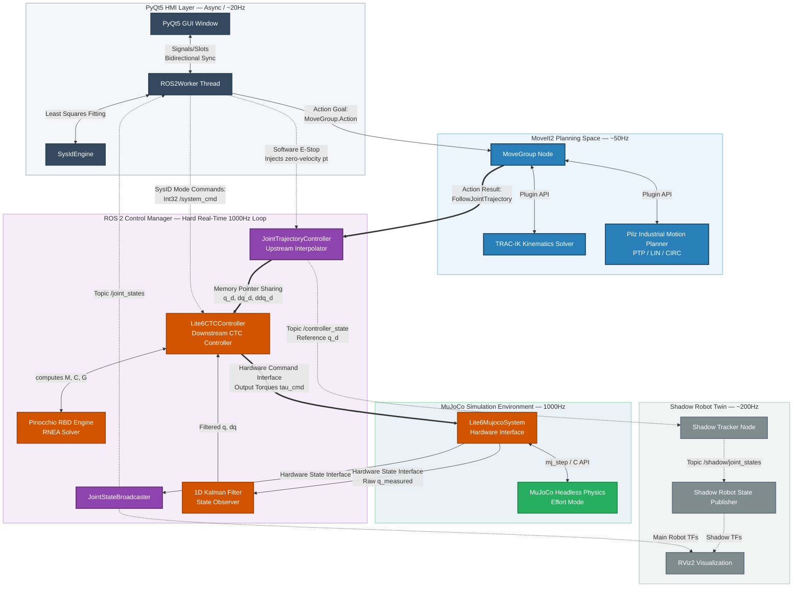
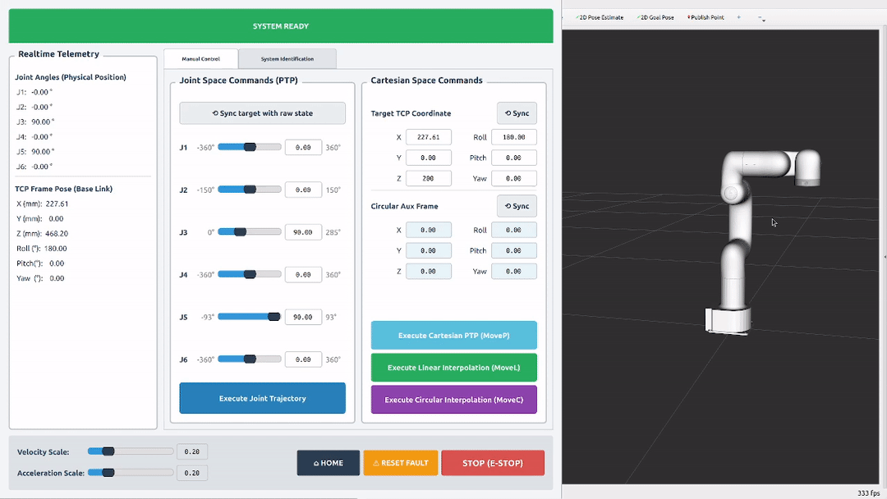
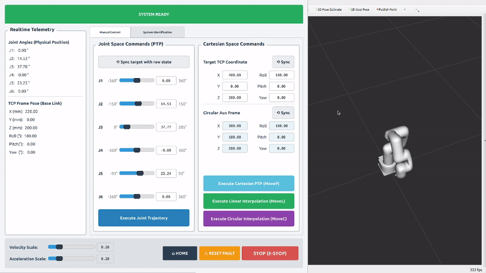

# ROS 2 Dynamics Controller for Lightweight 6-Axis Robotic Arms


This repository presents a high-fidelity, mathematically rigorous 6-axis robotic arm simulation. Initiated by an asynchronous and detailed GUI (based on PyQt5), the system orchestrates high-level motion using **MoveIt2**, leveraging **TRAC-IK** for robust numerical solutions for inverse kinematics and the **Pilz** trajectory planning engine for deterministic Cartesian paths (LIN/CIRC). At the core, **Controller Chaining** (based on **ros2_control**) interpolates these trajectories into a tight 1000Hz reference for a custom **Computed Torque Control (CTC)** controller. To ensure physical realism, the CTC bypasses **MuJoCo**’s default PID joints to run the MuJoCo physics engine in pure **effort mode**. The CTC processes the feedback states via a **Kalman Filter** state observation model to reconstruct noise-free joint velocities, and executes **Pinocchio** dynamics calculations to compute rigid-body inertia, gravity, and Coriolis matrices. Combined with **complete friction/armature compensation** (smoothly neutralizing viscous damping, Coulomb stiction, and motor rotor inertia), this architecture achieves a tracking precision of ($<0.01\text{ mm}$).

To bridge the gap between nominal simulation parameters and real-world physical discrepancies, an automated **system identification** (SysID) framework is integrated to extract joint-level viscous/Coulomb friction and motor armature coefficients, which are difficult to measure directly during manufacturing. Utilizing a bounded **Fourier excitation trajectory** coupled with an offline **Least-Squares solver**, the identified parameters align closely with the ground-truth physical properties defined in the URDF and MuJoCo XML files. Furthermore, the architecture incorporates a robust software emergency stop (E-Stop) and active recovery state machine. Upon triggering, it overrides high-level commands to execute precise, limit-aware deceleration trajectories that safely halt the manipulator, while providing a seamless recovery sequence back to the active closed-loop tracking state.

To facilitate real-time diagnostics and visual verification of tracking performance, the framework incorporates a synchronized **"shadow robot"** virtual twin. This visualization layer directly renders the ideal, perturbation-free trajectory generated by the upstream interpolator, representing the manipulator's theoretical kinematic state under zero-disturbance conditions. The shadow robot depicts pure kinematic commands, while the closed-loop CTC controller forces the physical manipulator to actively overcome nonlinear physical disturbances (gravity, Coriolis, joint friction, etc.) to track this reference. Under normal operating conditions, the physical robot tracks the shadow twin tightly. However, in two specific scenarios there will be visible tracking deviation: 1. **E-Stop:** Triggering an E-Stop during high-speed maneuvers causes the physical robot to diverge from the shadow; this occurs because the physical manipulator executes a limit-aware deceleration trajectory to protect the hardware, while the reference command stream halts instantaneously. 2. **System Identification:** During the Fourier excitation routine, the physical robot deviates significantly from the shadow twin, because all feedback and dynamic feedforward compensations are temporarily deactivated to isolate and excite the raw physical dynamics of the plant.

For detailed mathematical derivations, please refer to [Theory.md](Theory.md).

> ⚠️ **Notice:** The robot model used in this simulation is the **UFactory Lite6**, sourced from the official [MuJoCo Menagerie](https://github.com/google-deepmind/mujoco_menagerie). This repository is an independent open-source project designed for research and educational purposes.

<p align="center">
  
</p>


## 📑 Table of Contents
1. [System Architecture](#-system-architecture)
2. [Core Features & Demonstrations](#-core-features--demonstrations)
3. [Quick Start & Reproduction Guide](#-quick-start--reproduction-guide)
4. [Future Work](#-future-work)
5. [Acknowledgements](#-acknowledgements)
6. [Disclaimer](#-disclaimer)


## 🧠 System Architecture
The system's architecture is illustrated in the diagram below:



## 🎥 Core Features & Demonstrations

### 1. Industrial Motion Planning (PTP, MoveL, MoveC)

*   **PTP (Point-to-Point):** Joint space planning to specific angles or Cartesian poses (MoveP) via TRAC-IK:
<p align="center">
  
</p>

*   **MoveL:** Deterministic linear Cartesian interpolation via the Pilz planner:

<p align="center">
  
</p>

*   **MoveC:** Circular Cartesian interpolation using an auxiliary midpoint frame:

<p align="center">
  
</p>

*(Note: For MoveL and MoveC, it is recommended to lower the velocity and acceleration scale, to make sure that the trajectory planning doesn't exceed the robot's physical limits; otherwise, trajectory planning may fail.)*

### 2. Automated System Identification
*   Executes bounded Fourier excitation trajectories.
*   Records $q, \dot{q}, \tau$ and utilizes **Least Squares Optimization** to extract exact **Armature, Viscous Friction, and Coulomb Friction** matrices.

<p align="center">
  
</p>

### 3. The "Shadow Robot" Debugging Twin
*   A collision-free, cyan-colored digital twin runs alongside the main robot. It perfectly reflects the unperturbed JTC reference trajectory, allowing instant visual verification of tracking error and dynamic deviations.

<p align="center">
  
</p>

### 4. Software E-Stop and Recovery
*   Emergency stop overriding MoveIt.
*   Generates a safe deceleration trajectory based on physical kinematic limits.

<p align="center">
  
</p>

## 🚀 Quick Start & Reproduction Guide

This project is fully containerized using Docker to eliminate OS and dependency conflicts. You do not need to install ROS 2 or MuJoCo on your host machine.

### 📋 Prerequisites
Before starting, ensure your system has the following installed:
1. **Linux Host** (Ubuntu 22.04 recommended).
2. [**Docker Engine**](https://docs.docker.com/engine/install/).
3. [**NVIDIA Container Toolkit**](https://docs.nvidia.com/datacenter/cloud-native/container-toolkit/latest/install-guide.html): Recommended for GUI rendering and GPU acceleration (the script will automatically detect your hardware and choose suitable drives if you are using an Intel/AMD GPU or no GPU).

### 📂 Step 1: Prepare the Workspace
Create a workspace folder `~/lite6_ws/`; download the repository, extract it and copy the files to the workspace folder like this:

```text
~/lite6_ws/
├── mujoco-3.9.0/          # MuJoCo binaries
├── src/                   # Source code (lite6_bringup, lite6_controllers, etc.)
├── Dockerfile             # Docker configuration
├── run_docker.sh          # Container boot script
├── Readme.md
└── Theory.md
```

### 🐳 Step 2: Start the Docker Environment
Open a terminal on your host machine, navigate to the workspace, and execute the startup script.

```bash
cd ~/lite6_ws
chmod +x ./run_docker.sh
./run_docker.sh
```

### 🏗️ Step 3: Build and Launch (Inside Docker)
Inside the Docker terminal, build the ROS 2 packages and launch the system:

```bash
colcon build --symlink-install

source install/setup.bash

ros2 launch lite6_bringup system_bringup.launch.py
```

*(Note: If you reboot your computer, you can repeat Step 2 and Step 3 to launch the robot again.  In addition, since the `run_docker.sh` script uses a "shared folder" feature, the `src` folder on your computer is directly linked to the inside of Docker. You **do not** need to rebuild the Docker image every time you change the code.)*

## 🔮 Future Work
This framework is actively evolving. Upcoming features include:
- **End-Effector Integration:** Adding URDF and controller support for parallel jaw grippers.
- **Impedance / Admittance Control:** Transitioning from strict position tracking to compliant Cartesian control for physical human-robot interaction and assembly tasks.

## 🙏 Acknowledgements

I would like to sincerely thank the creators and maintainers of the following open-source projects and organizations:

*   **[MuJoCo](https://mujoco.org/)**
*   **[MuJoCo Menagerie](https://github.com/google-deepmind/mujoco_menagerie)**
*   **[ros2_control](https://control.ros.org/)**
*   **[Pinocchio](https://stack-of-tasks.github.io/pinocchio/)**
*   **[MoveIt2](https://moveit.ai/)**
*   **[Pilz Industrial Motion Planner](https://moveit.picknik.ai/main/doc/how_to_guides/pilz_industrial_motion_planner/pilz_industrial_motion_planner.html)**
*   **[TRAC-IK](https://traclabs.com/projects/trac-ik/)**

## ⚖️ Disclaimer

This is a personal, open-source project. I am not affiliated with, sponsored by, or endorsed by any commercial entities mentioned in this repository. All trademarks and registered trademarks are the property of their respective owners. The software is provided "as is", without warranty of any kind.